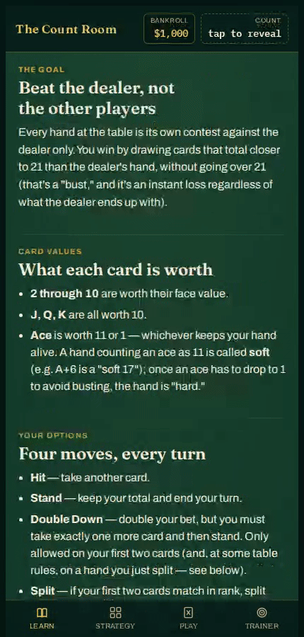

# The Count Room

A mobile-friendly blackjack table that teaches the rules, basic strategy, and Hi-Lo card counting — playable straight from a browser, no install.

**Play it live:** https://silentdark312.github.io/count-room/

*Making changes to this project? Read [`DEVELOPMENT.md`](DEVELOPMENT.md) first — it covers the architecture, the deliberate simplifications, and how to test changes without a real browser.*

## Showcase



*(Auto-generated by CI on every update — see [Regenerating the showcase](#regenerating-the-showcase) below. Higher-quality [MP4 version](docs/showcase.mp4) also available.)*

## What's inside

- **Learn** — how blackjack works, card values, your options each turn, the dealer's fixed rules, payouts, why card counting works at all, a plain-language guide to what a given true count actually means (worked example, illustrative bet ramp), and an interactive bankroll/risk-of-ruin simulator — run a batch of simulated sessions and see the actual spread of outcomes, not just the average.
- **Strategy** — full hard-total, soft-total, and pair charts, color-coded and matched to this game's exact rules, plus a reference table of the Illustrious 18 index plays.
- **Play** — real blackjack with a play-money bankroll, a shoe size from 1 to 8 decks, an optional basic-strategy hint on every hand, a separate toggle for count-based index plays, and a toggle to reveal the running/true count as you play. Table rules follow the shoe size the way real casinos actually pair them: 1 deck plays dealer-hits-soft-17 with double-after-split allowed, 2 decks plays dealer-stands with DAS, and 3+ decks plays the standard no-DAS rules. Three modes: **Free Play**, **Challenge** (fixed $500 stake, play till you bust, best run tracked locally), and **Count Drill** (hides the count and index-play hint, and checks your tracked running count against the real one before every deal — the one mode that combines live counting with actually playing hands).
- **Trainer** — three drills: a Strategy Trainer (one hand + dealer upcard at a time, pick the move, instant feedback), a speed drill that flashes cards for you to keep a running Hi-Lo count against, and a true-count quiz drilling the running-count ÷ decks-remaining arithmetic.

## Regenerating the showcase

The GIF/MP4 above are produced by [`.github/workflows/showcase.yml`](.github/workflows/showcase.yml), which runs a scripted walkthrough with Playwright on GitHub's Linux runners and commits the result back to `docs/`. It reruns automatically whenever `index.html` changes, or on demand:

```
gh workflow run showcase.yml
```

To run it locally (requires Node.js and ffmpeg):

```
npm install
npx playwright install --with-deps chromium
node scripts/record-showcase.mjs
ffmpeg -i videos/showcase.webm -vf "fps=12,scale=430:-1:flags=lanczos" docs/showcase.gif
```
